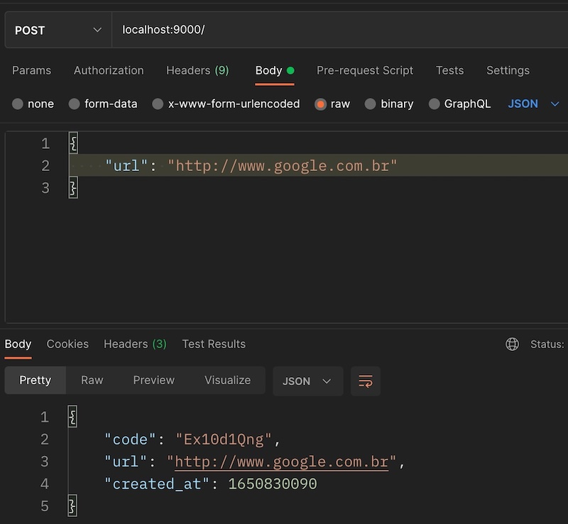
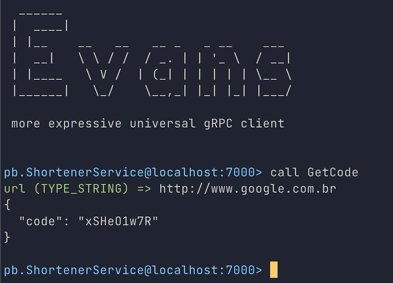

# Hexagonal Architecture in Golang

This application implements a Golang backend using Hexagonal Architecture which aims to decouple the components of the domain/application from the frameworks like http server, storage and others.

To demonstrate this, this application implements a simple URL Shortener which makes use of different adapters. The application can be executed from command-line, or as a service (HTTP and gRPC).

## Goals
- Implement some service using the principles of the Hexagonal Architecture.
- Use more than one framework for the same function, to demonstrante how the ports and adapters works in practice.
- Create a project template.

#### Storage adapters:
- MongoDB
- Redis

#### Serializer adapters:
- JSON
- MessagePack

#### Communication adapters:
- Gin http server
- Chi http server
- gRPC

## Steps to run the cli application
The application needs an instance of Redis or MongoDB running. Just check the [cmd/cli/main.go](cmd/cli/main.go) or [cmd/http/main.go](cmd/http/main.go) and adjust the connection string for your servers.

```bash
$ go run cmd/cli/main.go
```
You would get an output like the following:

```bash
Generating Code from URL: http://www.google.com
{"code":"LWK9v1Qng","url":"http://www.google.com","created_at":1650829428}

Retrieve the URL from code: LWK9v1Qng
{"code":"LWK9v1Qng","url":"http://www.google.com","created_at":1650829428}
```


## Steps to run the service application
```bash
$ go run cmd/http/main.go
```
You would get an output like the following:

```bash
CHI  listening on :8000
GIN  listening on :9000
GRPC listening on :7000
```

From now, you can perform HTTP requests on http://localhost:8000 and http://localhost:9000

### HTTP: Get Url (or redirect if call from browser)
```
Method GET
Endpoint: <hostname:port>/:code
```
Code is the short code generated from a given URL.

### HTTP: Generate Shortcode
```
Method POST
Endpoint: <hostname:port>/
```
Payload: 
```json
{
    "url": "http://www.google.com"
}
```


Example using curl:
```bash
curl --request POST 'localhost:9000/' \
--header 'Content-Type: application/json' \
--data '{"url": "http://www.google.com.br"}'
```

Expected output
```bash
{"code":"AS4YOJQ7R","url":"http://www.google.com.br","created_at":1650830243}
```

### gRPC
The code show how to use [evans](https://github.com/ktr0731/evans) in interactive mode to perform gRPC call.

```bash
cd adapter/grpc/proto 
evans --host localhost --port 7000 --proto shortener_msg.proto,shortener_service.proto
```



## TO-DO
- Add adapter for Jwt and Paseto tokens
